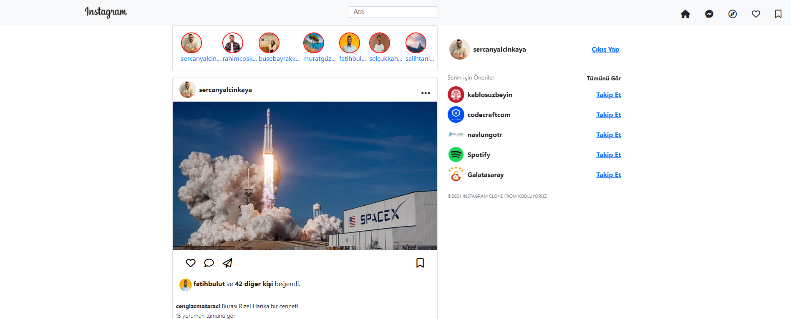

📸 Instagram Clone - Frontend Projesi
Bu proje, Kodluyoruz Front-End eğitiminde verilen bir ödev kapsamında geliştirilmiş bir Instagram ana sayfa klonudur. Proje yalnızca HTML ve CSS (Bootstrap 5 kütüphanesi) kullanılarak yapılmıştır.

🧩 Kullanılan Teknolojiler
HTML5 – Sayfa yapısını oluşturmak için

CSS3 – Stil düzenlemeleri için

Bootstrap 5 – Responsive grid yapısı, navbar ve diğer bileşenler için

Font Awesome – İkonlar için

📷 Proje Özellikleri
Sayfada üstte sabitlenen bir navbar (logolu ve arama çubuğu içeren)

Hikaye alanı (kullanıcıların profil resimleriyle yatay kaydırmalı yapı)

Gönderi kartları (kullanıcı adı, fotoğraf, ikonlar, yorumlar)

Sağ panelde önerilen kullanıcılar

Tüm sayfa responsive olarak tasarlanmıştır

📎 Görsel
Aşağıda proje ekran görüntüsü yer almaktadır:

🎓 Öğrenilen Konular
Bootstrap grid sistemi (col, row, offset, margin)

Sticky navbar kullanımı

Responsive tasarım oluşturma

Font Awesome ikonları entegre etme

d-flex, justify-content, align-items gibi sınıfların etkili kullanımı

📄 Lisans
Bu proje MIT Lisansı ile lisanslanmıştır.

